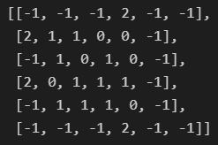
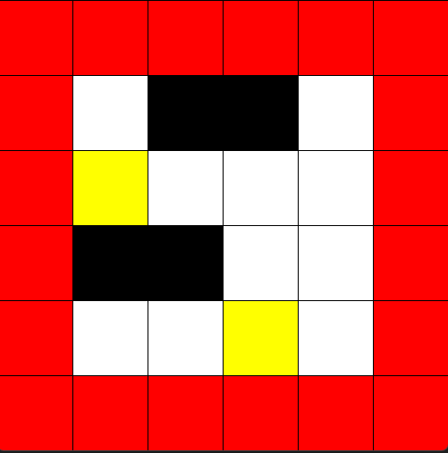

# Shover World Environment
Shover is a game that challenges the player to remove all the boxes from a deck that contains various obstacles. The player has to use the minimum amount of energy to complete the task. This report aims to design a simulator for this game that can accommodate different types of players, whether they are human or artificial.
To create the game environment and the graphical interface, we use the Gymnasium and Pygame libraries respectively. The following sections provide a short overview of these two tools.

## Environment Properties
In this section, we describe the structure and rules of our environment. 
We use an n * n array to represent the deck, where each element of the array has a value of -1, 0, 1, or 2. These values indicate the following states:
- **-1** means the space outside the deck (called lava in the code), where the player has to move the boxes to clear the deck. The lava is colored **red** in the graphical interface.
- **0** means empty slots in the deck. The empty slots are colored **white** in the graphical interface.
- **1** means boxes that the player can push. The boxes are colored **yellow** in the graphical interface.
- **2** means obstacles that block the movement of the player and the boxes. The obstacles are fixed and cannot be moved. They can be placed next to the edge of the deck. The obstacles are colored **black** in the graphical interface.



An action in this environment is defined as a pair of values, consisting of the coordinates of the **box** that the agent wants to **push** and the **direction** of its movement. The direction is encoded as an integer, where 0 and 2 mean up and down, and 1 and 3 mean right and left. 

It is important to note that pushing a box affects all the boxes in the same line of movement, as they will also move one step in the same direction. Moreover, if a box reaches the **edge** of the deck, it will fall off and disappear from the environment.

The agent has a limited amount of **energy** to complete the task, which is reflected in the **reward function**. Every time the agent pushes a box, it loses one unit of energy, which corresponds to a reward of -1. However, if the agent repeats the same action as the previous one, it saves one unit of energy, which corresponds to a reward of +1.

## Initialization Parameters
- `render_mode`: Specifies the rendering mode for the visualization (`'human'`, `'ansi'`, or `'rgb_array'`).

- `n_rows`: The number of rows in the grid.

- `n_cols`: The number of columns in the grid.

- `max_timestep`: The maximum number of timesteps before the environment automatically resets.

- `number_of_boxes`: The number of boxes placed in the grid.

- `number_of_barriers`: The number of non-movable barriers in the grid.

## Render
The render method is a function that creates a graphical interface for the game environment using the pygame library.
To use the render method, you need to have pygame installed on your system. You can install it using pip:

```bash
pip install pygame
```

You also need to have an instance of the game environment, which you can create by importing the Shover class from the shover.py file and calling its constructor with the desired parameters:

```python
from shover import Shover

env = Shover(n_rows=10, n_cols=10, number_of_boxes=5, number_of_barriers=10, render_mode="human")
```

Then, you can call the render method on the environment instance, either inside a loop or after taking an action:



## Usage Example 
```python
import gym

# Create the environment
env = ShoverWorldEnv(render_mode='human', n_rows=6, n_cols=6, max_timestep=100, number_of_boxes=10, number_of_barriers=4)

# Start a new episode
observation = env.reset()

# Environment loop
done = False
while not done:
    action = env.action_space.sample()  # Replace with your agent's action
    observation, reward, done, info = env.step(action)
    env.render()

# Close the environment
env.close()
```
Please ensure that all dependencies, especially **gym** and **pygame**, are installed and correctly set up in your Python environment before running the **ShoverWorldEnv** module. Happy training!


